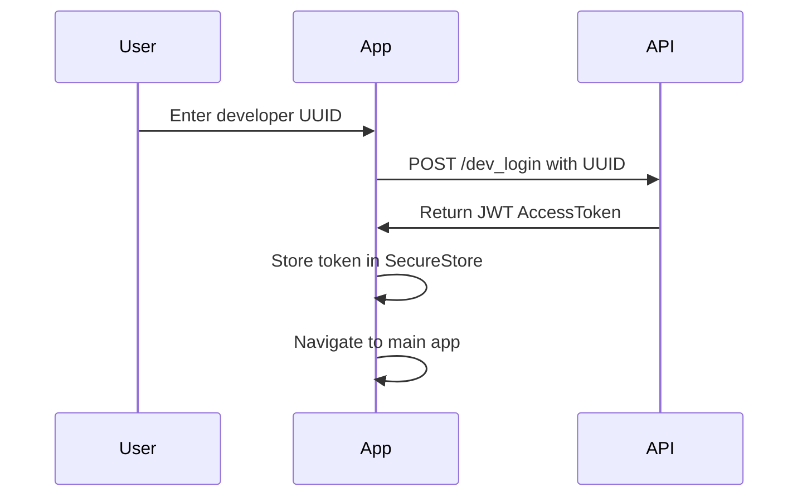

# Storage-Frontend

A cross-platform application built with React Native and Expo that provides a frontend interface for the Storage-API backend. The application supports both web and mobile platforms, offering a seamless experience across devices.

## Project Structure

```
storage-frontend/
├── app/                    # Main application code
│   ├── components/         # Reusable UI components
│   │   ├── auth/           # Authentication components
│   │   ├── camera/         # Camera and image capture components
│   │   ├── products/       # Product management components
│   │   └── common/         # Shared UI elements
│   ├── hooks/              # Custom React hooks
│   ├── navigation/         # Navigation configuration
│   ├── screens/            # Application screens
│   │   ├── auth/           # Authentication screens
│   │   ├── products/       # Product management screens
│   │   └── camera/         # Camera screens
│   ├── services/           # API and service integrations
│   │   ├── api/            # API client and endpoints
│   │   ├── auth/           # Authentication services
│   │   ├── vision/         # Google Cloud Vision services
│   │   └── storage/        # Local storage utilities
│   ├── store/              # State management
│   │   ├── slices/         # Redux slices
│   │   └── index.js        # Store configuration
│   └── utils/              # Utility functions
├── assets/                 # Static assets
├── .env.example            # Example environment variables
├── app.json                # Expo configuration
└── babel.config.js         # Babel configuration
```

## Tech Stack

- **React Native**: Chosen for cross-platform compatibility, allowing a single codebase to support both web and mobile platforms
- **Expo**: Provides a simplified development experience with pre-built native components and easy deployment options
- **Redux Toolkit**: State management solution for predictable state updates and centralized application logic
- **React Navigation**: Handles navigation between screens with native-feeling transitions on all platforms
- **Expo Camera**: Provides access to device cameras with cross-platform compatibility
- **React Native Paper**: Material Design component library for consistent UI across platforms
- **Axios**: HTTP client for API requests with interceptor support for handling JWT tokens
- **@google-cloud/vision**: Google Cloud Vision API client for direct OCR processing
- **react-native-web**: Enables web compatibility for React Native components
- **Jest & React Testing Library**: Testing frameworks for unit and integration tests
- **TypeScript**: Adds static typing for improved developer experience and code quality

## Authentication Flow

The application uses JWT-based authentication with the Storage-API's `/dev_auth` endpoint:



### JWT Token Handling

```typescript
// services/auth/tokenService.js
import * as SecureStore from 'expo-secure-store';
import { Platform } from 'react-native';
import AsyncStorage from '@react-native-async-storage/async-storage';

const TOKEN_KEY = 'storage_api_token';

// Use SecureStore on native platforms, AsyncStorage for web
const storage = Platform.OS === 'web' ? AsyncStorage : SecureStore;

export const storeToken = async (token) => {
  await storage.setItem(TOKEN_KEY, token);
};

export const getToken = async () => {
  return await storage.getItem(TOKEN_KEY);
};

export const removeToken = async () => {
  await storage.removeItem(TOKEN_KEY);
};
```

## OCR and Product Matching Integration

The application utilizes Google Cloud Vision API directly from the frontend for OCR processing, with two distinct flows for adding new products or modifying existing ones:

1. **Initial Selection**: User selects whether to add a new product or add/modify an existing product
2. **Capture Image**: User captures an image using the Expo Camera
3. **Process OCR in Frontend**: Image is sent directly to Google Cloud Vision API from the frontend
4. **Extract Text**: Frontend parses OCR response to extract relevant product information

### Flow for New Products:
5a. **Send OCR Text to Backend**: Send extracted text to a backend endpoint that converts OCR text to a new product structure
6a. **Display Converted Product**: Show the structured product data returned from the API
7a. **User Confirms**: User reviews and confirms the new product details
8a. **Save to Database**: Backend saves the new product to the database

### Flow for Existing Products:
5b. **Two API Calls**:
   - First API call: Convert OCR to product structure (display result)
   - Second API call: Match products, returning 3-5 best matches from database
6b. **Display Matches**: Show the potential matching products from the database
7b. **User Selects Match**: User selects the correct product from matches
8b. **User Inputs Quantity**: User inputs quantity to add or remove
9b. **Update Database**: User clicks Add/Remove button to update the product quantity in database

```mermaid
Start[Start] --> A[User Selects: New or Existing Product]
    A -->|New Product| B1[Capture Image]
    A -->|Existing Product| B2[Capture Image]
    
    B1 --> C1[Process OCR in Frontend]
    B2 --> C2[Process OCR in Frontend]
    
    C1 --> D1[Extract Text from OCR Response]
    C2 --> D2[Extract Text from OCR Response]
    
    D1 --> E1[Send OCR Text to Backend Convert API]
    D2 --> E2[Two API Calls: Convert + Match Products]
    
    E1 --> F1[Display Converted Product Structure]
    E2 --> F2[Display Converted Structure and 3-5 Matches]
    
    F1 --> G1[User Reviews and Confirms]
    F2 --> G2[User Selects Correct Product]
    
    G1 --> H1[User Inputs Quantity to Add]
    G2 --> H2[User Inputs Quantity to Add/Remove]
    
    H1 --> I2[Save New Product to Database with Inputed Quantity]
    H2 --> I2[User Clicks Add/Remove Button]
    I2 --> J2[Update Product Quantity in Database]
    
    H1 --> End[End]
    J2 --> End
```


### Google Cloud Vision Integration

The application integrates Google Cloud Vision API directly in the frontend:

```typescript
// services/vision/visionService.ts
import axios from 'axios';
import { GOOGLE_CLOUD_VISION_API_KEY } from '@env';

// Base URL for Google Cloud Vision API
const VISION_API_URL = 'https://vision.googleapis.com/v1/images:annotate';

export interface OCRResult {
  text: string;
  confidence: number;
  boundingBox?: {
    vertices: Array<{x: number, y: number}>
  };
}

/**
 * Process image using Google Cloud Vision OCR
 * @param imageBase64 - Base64 encoded image
 * @returns Extracted text with confidence scores
 */
export const processImageOCR = async (imageBase64: string): Promise<OCRResult[]> => {
  try {
    const response = await axios.post(
      `${VISION_API_URL}?key=${GOOGLE_CLOUD_VISION_API_KEY}`,
      {
        requests: [
          {
            image: {
              content: imageBase64
            },
            features: [
              {
                type: 'TEXT_DETECTION',
                maxResults: 10
              }
            ]
          }
        ]
      }
    );

    if (!response.data.responses[0].textAnnotations) {
      return [];
    }

    // Extract text annotations from response
    const textAnnotations = response.data.responses[0].textAnnotations;
    
    // First result contains full text, following results are individual words/blocks
    const results: OCRResult[] = textAnnotations.map(annotation => ({
      text: annotation.description,
      confidence: annotation.confidence || 0,
      boundingBox: annotation.boundingPoly
    }));

    return results;
  } catch (error) {
    console.error('Error processing image with Google Cloud Vision:', error);
    throw error;
  }
};

/**
 * Extract product information from OCR results
 * @param ocrResults - Results from OCR processing
 * @returns Structured product data
 */
export const extractProductInfo = (ocrResults: OCRResult[]) => {
  // Extract full text from first result (contains entire text)
  const fullText = ocrResults[0]?.text || '';
  
  // Basic extraction logic - in production would be more sophisticated
  // using regex patterns or NLP techniques
  return {
    fullText,
    parsedInfo: {
      name: extractProductName(fullText),
      expirationDate: extractExpirationDate(fullText),
      quantity: extractQuantity(fullText),
      category: guessCategory(fullText)
    }
  };
};

// Helper functions for extraction...
const extractProductName = (text) => { /* implementation */ };
const extractExpirationDate = (text) => { /* implementation */ };
const extractQuantity = (text) => { /* implementation */ };
const guessCategory = (text) => { /* implementation */ };
```

## Expo Camera Usage

The application uses Expo Camera for capturing product images, now with integrated OCR processing:

```typescript
// components/camera/ProductCamera.tsx
import React, { useState, useRef, useCallback } from 'react';
import { StyleSheet, View, TouchableOpacity } from 'react-native';
import { Camera } from 'expo-camera';
import { Text, IconButton, ActivityIndicator } from 'react-native-paper';
import * as ImageManipulator from 'expo-image-manipulator';
import * as FileSystem from 'expo-file-system';
import { processImageOCR, extractProductInfo } from '../../services/vision/visionService';
import { useDispatch } from 'react-redux';
import { setOcrResults } from '../../store/slices/ocrSlice';

export const ProductCamera = ({ onCapture, navigation }) => {
  const [hasPermission, setHasPermission] = useState(null);
  const [processing, setProcessing] = useState(false);
  const cameraRef = useRef(null);
  const dispatch = useDispatch();

  useEffect(() => {
    (async () => {
      const { status } = await Camera.requestCameraPermissionsAsync();
      setHasPermission(status === 'granted');
    })();
  }, []);

  const takePicture = async () => {
    if (cameraRef.current) {
      try {
        setProcessing(true);
        
        // Take picture
        const photo = await cameraRef.current.takePictureAsync();
        
        // Optimize image for processing
        const optimizedImage = await ImageManipulator.manipulateAsync(
          photo.uri,
          [{ resize: { width: 1000 } }],
          { compress: 0.7, format: ImageManipulator.SaveFormat.JPEG, base64: true }
        );
        
        // Process with Google Cloud Vision
        const ocrResults = await processImageOCR(optimizedImage.base64);
        
        // Extract product information from OCR results
        const productInfo = extractProductInfo(ocrResults);
        
        // Store results in Redux
        dispatch(setOcrResults({ 
          ocrResults, 
          productInfo,
          imageUri: optimizedImage.uri 
        }));
        
        // Navigate to results screen
        navigation.navigate('OCRResults');
        
        // Also pass to callback if needed
        onCapture && onCapture({
          imageUri: optimizedImage.uri,
          ocrResults,
          productInfo
        });
        
      } catch (error) {
        console.error('Error processing image:', error);
        alert('Error processing image. Please try again.');
      } finally {
        setProcessing(false);
      }
    }
  };

  if (hasPermission === null) {
    return <View />;
  }
  if (hasPermission === false) {
    return <Text>No access to camera</Text>;
  }

  return (
    <View style={styles.container}>
      <Camera style={styles.camera} ref={cameraRef} type={Camera.Constants.Type.back}>
        <View style={styles.buttonContainer}>
          {processing ? (
            <ActivityIndicator size="large" color="#fff" />
          ) : (
            <TouchableOpacity style={styles.button} onPress={takePicture}>
              <IconButton icon="camera" size={32} color="#fff" />
            </TouchableOpacity>
          )}
        </View>
      </Camera>
    </View>
  );
};

const styles = StyleSheet.create({
  container: {
    flex: 1,
  },
  camera: {
    flex: 1,
  },
  buttonContainer: {
    flex: 1,
    backgroundColor: 'transparent',
    flexDirection: 'row',
    justifyContent: 'center',
    margin: 20,
  },
  button: {
    alignSelf: 'flex-end',
    alignItems: 'center',
    backgroundColor: 'rgba(0,0,0,0.5)',
    borderRadius: 50,
    padding: 15,
  },
});
```

## Component Breakdown

### LoginComponent
Handles user authentication with the `/dev_auth` endpoint.

### OCRComponent
Manages image capture and processes OCR using Google Cloud Vision API directly in the frontend.

### ProductListComponent
Displays products in a list or grid view with filtering and sorting options.

### ProductEditorComponent
Allows users to edit product details after OCR processing or manual entry.

### CameraComponent
Provides interface for capturing images on mobile devices.

### WebUploadComponent
Alternative to CameraComponent for web platforms, with integrated OCR processing.

### OCRResultsComponent
Displays OCR processing results and allows user to confirm or edit before saving.

### PermissionManager
Handles camera and storage permissions on mobile platforms.

### TokenManager
Manages JWT token storage, retrieval, and refreshing.

## Web-Specific Adjustments

For handling large data tables (~700 rows) on web platforms:

1. **Virtualized Lists**: Implement windowing techniques to render only visible rows
   ```typescript
   import { VirtualizedList } from 'react-native';
   
   const ProductTable = ({ products }) => {
     return (
       <VirtualizedList
         data={products}
         initialNumToRender={20}
         renderItem={({ item }) => <ProductRow product={item} />}
         keyExtractor={item => item.uuid}
         getItemCount={data => data.length}
         getItem={(data, index) => data[index]}
         maxToRenderPerBatch={20}
         windowSize={10}
       />
     );
   };
   ```

2. **Pagination**: Server-side pagination to fetch only necessary data
   ```typescript
   const [page, setPage] = useState(1);
   const [pageSize, setPageSize] = useState(50);
   
   useEffect(() => {
     fetchProducts(page, pageSize);
   }, [page, pageSize]);
   ```

3. **Lazy Loading**: Defer loading of non-critical components
   ```typescript
   const ProductDetails = React.lazy(() => import('./ProductDetails'));
   
   // Usage
   <Suspense fallback={<LoadingSpinner />}>
     <ProductDetails product={selectedProduct} />
   </Suspense>
   ```

4. **Debounced Search**: Optimize search functionality for large datasets
   ```typescript
   const debouncedSearch = useCallback(
     debounce((term) => {
       setSearchTerm(term);
     }, 300),
     []
   );
   ```

## Hardware Identity Provider Integration

The application is designed with future flexibility for hardware-based identity providers:

1. **Abstracted Authentication Layer**: Authentication modules are abstracted to allow easy replacement
2. **Pluggable Identity Providers**: Architecture supports adding new identity providers
3. **Device Information Collection**: Framework for collecting and validating device identifiers
4. **Biometric Support**: Integration with Expo's LocalAuthentication for biometric authentication
5. **Secure Key Storage**: Uses secure storage for sensitive authentication information

```typescript
// Example of pluggable auth provider system
const authProviders = {
  developer: DeveloperAuthProvider,
  hardware: HardwareAuthProvider,
  biometric: BiometricAuthProvider,
};

const AuthProvider = ({ type = 'developer', children }) => {
  const Provider = authProviders[type] || authProviders.developer;
  return <Provider>{children}</Provider>;
};
```

## Environment Variables

The application uses environment variables for configuration:

```
# .env.example
API_URL=http://localhost:8000
AUTH_ENDPOINT=/dev_login
PRODUCTS_ENDPOINT=/products
ENABLE_CAMERA=true
LOG_LEVEL=info
SENTRY_DSN=https://your-sentry-dsn
STORAGE_PREFIX=storage_app_
GOOGLE_CLOUD_VISION_API_KEY=your-google-cloud-vision-api-key
```

Usage with the `react-native-dotenv` package:

```typescript
// babel.config.js
module.exports = function(api) {
  api.cache(true);
  return {
    presets: ['babel-preset-expo'],
    plugins: [
      ["module:react-native-dotenv", {
        "moduleName": "@env",
        "path": ".env",
        "blacklist": null,
        "whitelist": null,
        "safe": false,
        "allowUndefined": true
      }]
    ]
  };
};

// Usage in code
import { API_URL, AUTH_ENDPOINT, GOOGLE_CLOUD_VISION_API_KEY } from '@env';

const loginUrl = `${API_URL}${AUTH_ENDPOINT}`;
```

## Setup Instructions

### Prerequisites
- Node.js 14+
- Yarn or npm
- Expo CLI (`npm install -g expo-cli`)
- Google Cloud Vision API key
- For iOS development: Xcode
- For Android development: Android Studio

### Installation

1. Clone the repository
   ```bash
   git clone https://github.com/yourusername/storage-frontend.git
   cd storage-frontend
   ```

2. Install dependencies
   ```bash
   yarn install
   ```

3. Copy environment variables
   ```bash
   cp .env.example .env
   ```

4. Configure your environment variables in `.env`
   - Set your Google Cloud Vision API key in `GOOGLE_CLOUD_VISION_API_KEY`
   - Configure backend API URL in `API_URL`

### Setting up Google Cloud Vision API

1. Go to [Google Cloud Console](https://console.cloud.google.com/)
2. Create a new project (or select an existing one)
3. Navigate to "APIs & Services" > "Library"
4. Search for "Cloud Vision API" and enable it
5. Go to "APIs & Services" > "Credentials"
6. Create an API key
7. Add the API key to your `.env` file

### Running the Application

#### For development
```bash
# Start the Expo development server
expo start

# Run on iOS simulator
expo run:ios

# Run on Android emulator
expo run:android

# Run on web
expo start:web
```

#### Building for production
```bash
# Build for iOS
expo build:ios

# Build for Android
expo build:android

# Build for web
expo build:web
```

### Testing
```bash
# Run unit tests
yarn test

# Run component tests with coverage
yarn test:coverage

# Run E2E tests (requires running app)
yarn test:e2e
```

## Key Considerations

### Security
- JWT tokens are stored securely using `expo-secure-store` on mobile and `localStorage` with encryption on web
- API requests are secured with authorization headers
- Google Cloud Vision API key is securely managed and not exposed in client-side code for production builds
- Images are processed securely and permissions are requested appropriately
- All user inputs are validated both client-side and server-side

### Performance
- Frontend OCR processing reduces backend load but may impact client performance
- Image optimization before OCR processing to reduce API costs and improve response time
- Virtualized lists for handling large datasets
- Lazy loading of components and images
- Memoization of expensive calculations
- Debounced inputs for search and filtering

### OCR Considerations
- Handling limited mobile network connectivity by optionally storing images for later processing
- Fallback to backend OCR processing when Google Cloud Vision is unavailable
- Caching OCR results to prevent redundant API calls
- Error handling and retry mechanisms for OCR failures

### User Experience
- Responsive design for all screen sizes
- Offline capabilities with local caching
- Meaningful loading states and error messages
- Haptic feedback on mobile devices
- Accessibility considerations (WCAG compliance)
- Platform-specific UI adjustments for native feel

### Maintenance and Scalability
- Modular code structure for easy extensions
- Comprehensive unit and integration tests
- TypeScript for type safety and better developer experience
- Consistent code style with ESLint and Prettier
- Detailed documentation and code comments 